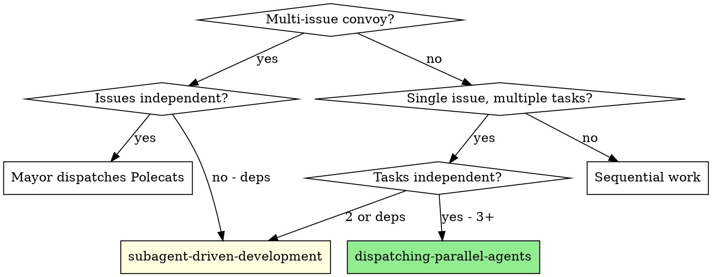
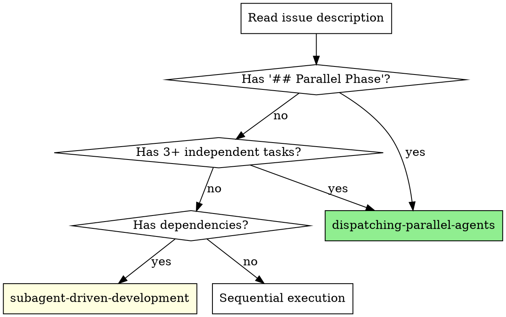
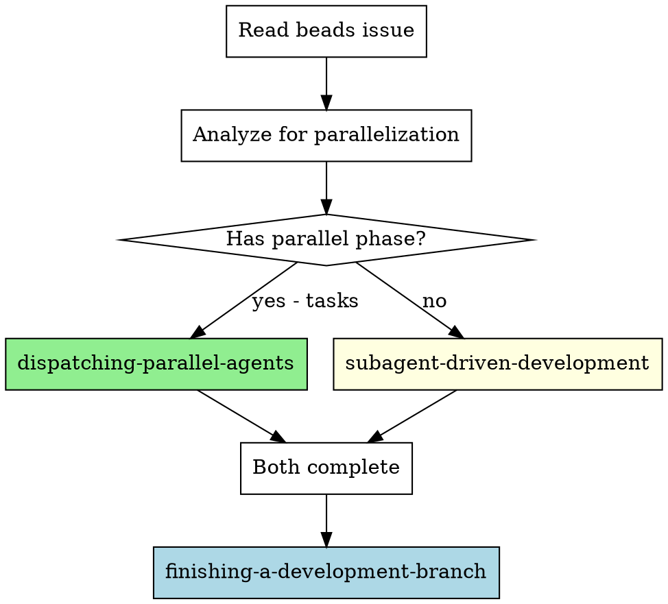

# Gastown Parallel Workflow

## Overview

This skill bridges two levels of orchestration:

1. **Gastown (cross-session):** Mayor coordinates Polecats across git worktrees
2. **Task subagents (in-session):** Multiple agents run concurrently in same worktree

**The insight:** These levels are complementary, not competing. Mayor distributes coarse-grained work (issues) to Polecats. Each Polecat can then parallelize fine-grained work (tasks) using subagents.

```
┌─────────────────────────────────────────────────────────────────┐
│ Mayor (main worktree)                                           │
│   └── Convoy: [bp-123, bp-124, bp-125]                         │
│       ├── Polecat 1 (worktree A) → bp-123                      │
│       │   └── subagents: [task A, task B, task C] (parallel)   │
│       ├── Polecat 2 (worktree B) → bp-124                      │
│       │   └── subagents: [task D, task E] (parallel)           │
│       └── Polecat 3 (worktree C) → bp-125                      │
│           └── sequential work (has dependencies)                │
└─────────────────────────────────────────────────────────────────┘
```

## When to Use



**Use this skill when:**
- Dispatching a convoy with 3+ issues
- Working on an issue with `## Parallel Phase` marker
- Coordinating Gastown orchestration with Task subagents
- You see parallelization hints in issue descriptions

**Don't use when:**
- Simple single-task work
- All tasks have sequential dependencies
- Shared state prevents parallelization

## Issue Templating Convention

### Phase Markers

Use markdown sections to signal parallelization intent:

```markdown
## Parallel Phase (dispatch subagents)
- [ ] Task A (independent)
- [ ] Task B (independent)
- [ ] Task C (independent)

## Sequential Phase (after parallel completes)
- [ ] Task D (depends on A, B, C)
- [ ] Task E (depends on D)
```

### Worker Recognition

When you see `## Parallel Phase`:
1. **Immediately recognize** this as a parallelization signal
2. **Use** `superpowers:dispatching-parallel-agents` for tasks in that section
3. **After** parallel phase completes, proceed to Sequential Phase

### Example Issue Description

```markdown
# Add multi-tenant support

## Context
We need to add organization-scoping to all data queries.

## Parallel Phase (dispatch subagents)
These changes are independent - can be done simultaneously:
- [ ] Add orgId column to Users table
- [ ] Add orgId column to Projects table
- [ ] Add orgId column to Documents table
- [ ] Create Organization model

## Sequential Phase (after parallel completes)
- [ ] Add org-scoping middleware (needs all columns)
- [ ] Update existing queries (needs middleware)
- [ ] Write migration script (needs all changes)
```

## Mayor Dispatch Patterns

When dispatching Polecats, include parallelization hints:

### Basic Dispatch

```
CONVOY: bp-123, bp-124, bp-125

PARALLELIZATION HINTS:
- bp-123 and bp-124 are independent → can work in parallel worktrees
- bp-125 depends on bp-123 → wait for bp-123 to complete first
- bp-123 has "## Parallel Phase" → Polecat should use dispatching-parallel-agents
- bp-124 is sequential → Polecat should use subagent-driven-development
```

### Phase-Structured Convoy

```
CONVOY STRUCTURE:

## Phase 1 (Parallel - dispatch simultaneously)
- bp-123: Add User authentication (independent)
- bp-124: Add Project CRUD (independent)
- bp-125: Add Document storage (independent)

## Phase 2 (Sequential - after Phase 1 completes)
- bp-126: Integrate auth with projects (needs bp-123, bp-124)
- bp-127: Add cross-resource search (needs all above)

HINTS FOR POLECATS:
- Phase 1 Polecats: Look for "## Parallel Phase" in your issue
- Phase 2 Polecats: Use subagent-driven-development with dependencies
```

### Dispatch Prompt Template

See `./mayor-dispatch.md` for complete Mayor prompt templates.

## Worker Recognition Patterns

When starting work on an issue:

### Signal Detection Checklist

1. **Check issue description** for phase markers:
   - `## Parallel Phase` → use dispatching-parallel-agents
   - `## Sequential Phase` → use subagent-driven-development
   - No markers → analyze task dependencies

2. **Count independent tasks**:
   - 3+ independent → consider dispatching-parallel-agents
   - 2 or with deps → use subagent-driven-development

3. **Check for parallelization hints**:
   - Look for "HINTS FOR POLECATS" section
   - Look for "can be done simultaneously" language
   - Look for explicit skill references

### Strategy Selection



See `./worker-patterns.md` for complete worker recognition patterns.

## Common Rationalizations (Anti-Patterns)

Agents often avoid parallelization with these rationalizations:

| Rationalization | Counter |
|----------------|---------|
| "I should understand the full picture first" | Parallel tasks are independent by definition - understanding one doesn't help with others |
| "Let me do this one thing first" | If it's parallel, "first" is arbitrary - dispatch all at once |
| "I want to maintain context" | Task subagents don't share context anyway - parallelization is lossless |
| "It's safer to go sequentially" | Independent tasks can't conflict - parallel is equally safe |
| "I'll parallelize later if needed" | Starting sequential creates sunk cost bias against switching |
| "This will be faster if I do it myself" | 3 agents working concurrently is faster than 1 working serially |
| "The tasks might be related" | If issue says "independent" or "parallel", trust it |

## Red Flags

**You might be missing parallelization opportunities if:**
- You see `## Parallel Phase` but don't use dispatching-parallel-agents
- You have 3+ tasks and start them sequentially
- You rationalize sequential work for "safety" when tasks are independent
- You ignore parallelization hints in the issue description
- You start sequential and never reconsider despite having parallel tasks

**You might be over-parallelizing if:**
- Tasks share state (editing same files)
- Tasks have hidden dependencies (one's output is another's input)
- Tasks need context from each other to be done correctly
- You're parallelizing just 2 tasks (overhead may exceed benefit)

## Integration with Superpowers

### Required Skills

**For parallel work:**
```
**REQUIRED:** superpowers:dispatching-parallel-agents
```

**For sequential work with review:**
```
**REQUIRED:** superpowers:subagent-driven-development
```

### Workflow Integration



## Example Workflows

### Example 1: Polecat with Parallel Phase

```
Mayor: Work on bp-123

[Polecat reads bp-123]
bp-123 contains:
  ## Parallel Phase
  - [ ] Add field A to model
  - [ ] Add field B to model
  - [ ] Add field C to model

  ## Sequential Phase
  - [ ] Update all queries to use new fields

Polecat recognizes "## Parallel Phase" marker:
  > I see a Parallel Phase with 3 independent tasks.
  > Using superpowers:dispatching-parallel-agents

[Dispatches 3 subagents]
Agent 1 → Add field A
Agent 2 → Add field B
Agent 3 → Add field C

[All complete]

Polecat proceeds to Sequential Phase:
  > Parallel phase complete. Moving to Sequential Phase.
  > Using subagent-driven-development for dependent work.

[Completes sequential tasks]
[Uses finishing-a-development-branch]
```

### Example 2: Mayor Structuring Convoy

```
Mayor analyzing 5 new issues:
- bp-200: Auth system (no deps)
- bp-201: User profiles (no deps)
- bp-202: Settings page (no deps)
- bp-203: Dashboard (depends on bp-200, bp-201)
- bp-204: Analytics (depends on bp-203)

Mayor creates structured convoy:

CONVOY STRUCTURE:

## Phase 1 (Parallel)
- bp-200: Auth system
- bp-201: User profiles
- bp-202: Settings page

## Phase 2 (After Phase 1)
- bp-203: Dashboard

## Phase 3 (After Phase 2)
- bp-204: Analytics

HINTS FOR POLECATS:
- bp-200 has multiple auth providers → consider parallel subagents
- bp-201 has avatar upload + profile fields → independent, can parallel
- bp-202 is straightforward → sequential is fine

[Mayor dispatches Phase 1 Polecats simultaneously]
[Waits for Phase 1]
[Dispatches Phase 2]
[Waits for Phase 2]
[Dispatches Phase 3]
```

### Example 3: Worker Missing Signal (Anti-Pattern)

```
[Polecat receives issue bp-300]
bp-300 contains:
  ## Parallel Phase (dispatch subagents)
  - [ ] Task A (independent)
  - [ ] Task B (independent)
  - [ ] Task C (independent)

[BAD] Polecat ignores marker:
  > Let me start with Task A to understand the codebase...
  [Works on Task A]
  > Now that I understand, let me do Task B...
  [Works on Task B]
  > Finally, Task C...

[GOOD] Polecat recognizes marker:
  > I see "## Parallel Phase" with 3 independent tasks.
  > Using dispatching-parallel-agents immediately.
  [Dispatches 3 subagents in parallel]
```

## Verification

After completing work:

1. **Did you recognize phase markers?**
   - If `## Parallel Phase` was present, did you use dispatching-parallel-agents?

2. **Did you parallelize when appropriate?**
   - 3+ independent tasks → should have used subagents

3. **Did you respect dependencies?**
   - Sequential Phase items → waited for Parallel Phase

4. **Did you avoid rationalizations?**
   - Didn't go sequential "just to be safe" for independent work

## Beads Integration

### Labels for Phase Tracking

```bash
bd label bp-123 parallel-phase-1
bd label bp-124 parallel-phase-1
bd label bp-125 sequential-phase-2
```

### Dependencies for Ordering

```bash
bd dep add bp-125 --blocks bp-126  # bp-125 must complete before bp-126
```

### Convoy View

```bash
bd list --label convoy-2026-02-01
```
